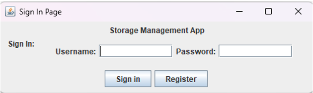
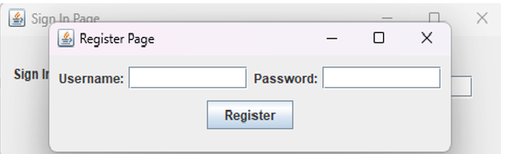
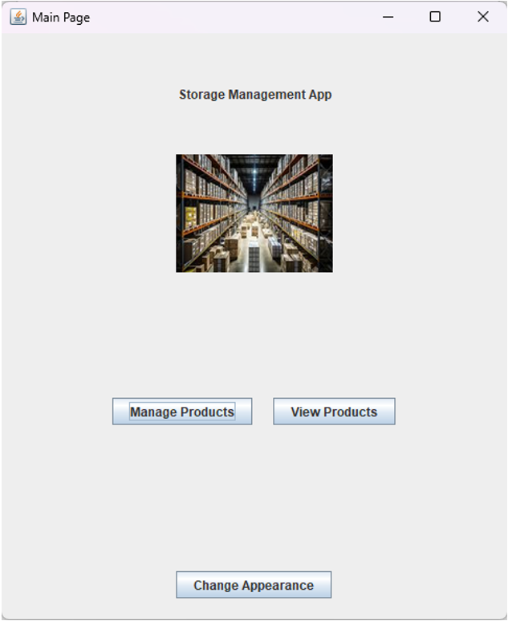
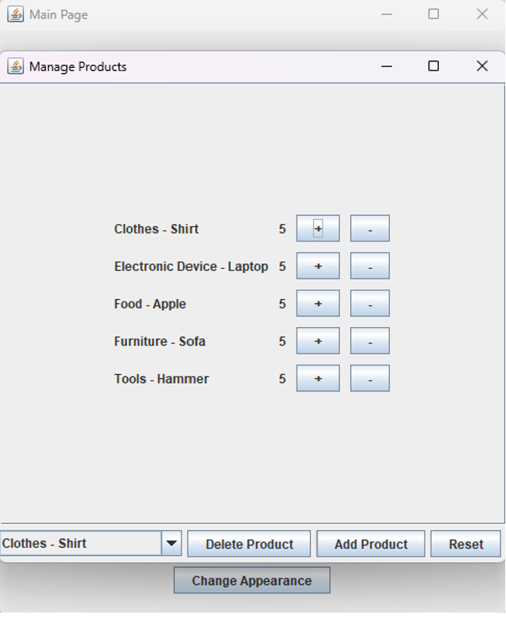
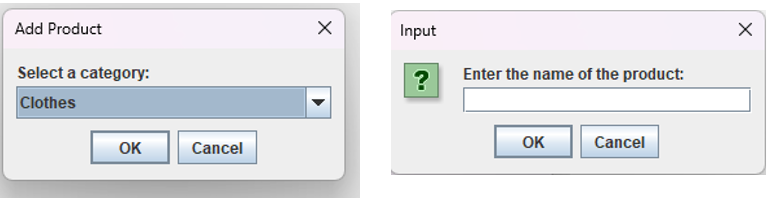
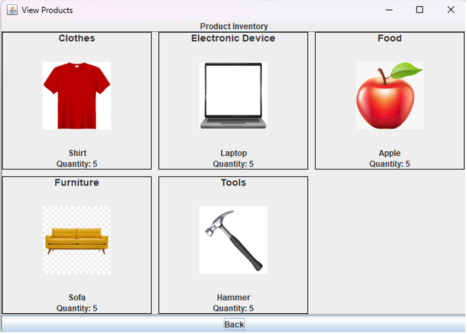

#📦 Storage Management System (Java)

##📌 Overview
The Storage Management System is a desktop inventory management application developed using Java Swing. The application allows users to create accounts, log in securely, manage product inventory, view stored products, and customize the application’s appearance.
This project was developed as part of Object-Oriented Programming II (CCCS 214) at the University of Jeddah.

---

## ✨ Features

### 🔐 User Authentication
- User registration system
- Secure login functionality
- Input validation with success/error messages
- Navigation between registration and login screens

---

### 📦 Product Inventory Management
- Add new products with category selection
- Automatically assigns default product quantity
- Increase or decrease product quantity
- Delete products from inventory
- Reset inventory changes

---

### 🖥 Product Viewing Interface
- Displays all stored products in a clean layout
- Shows:
  - Product category
  - Product image
  - Product name
  - Current quantity
    
 ---

### 🎨 Appearance Customization
- Users can change application color theme
- Appearance changes apply to all application screens
- Supports multiple theme options

---

## 🧠 Application Workflow
When the application starts:

### 1️⃣ User Authentication
When the application starts:

- Users are greeted with a Sign In page
- Users can:
  - Enter username and password to log in
  - Navigate to registration page if they do not have an account
  - After registering, users return to login page to access the system

---

### 2️⃣ Main Dashboard
After successful login, users are directed to the main page where they can:

- Manage Products
- View Products
- Change Application Appearance

---

### 3️⃣ Managing Products
Users can:

- Add new products
- Select product category
- Enter product name
- Automatically assign default quantity (5 units)
- Increase or decrease quantity using buttons
- Delete last added product
- Reset product list

---

### 4️⃣ Viewing Products
- The View Products page provides:
- Visual display of all products
- Product images
- Product categories
- Current product quantity
- Organized grid layout for easy navigation

---

### 5️⃣ Changing Appearance
Users can:

- Select different UI color themes
- Apply theme changes across all application panels
- Customize overall user interface appearance

---

## 📂 Project Structure

Storage-Management-System-Java
│
├── SignInPage.java
├── RegisterPage.java
├── MainPagePanel.java
├── ManageProducts.java
├── ProductInventory.java
├── ViewProductsPanel.java
├── AppearanceSettings.java
├── BuildAppearancePanel.java

---
## 📷 Application Screenshots

### 🔐 Sign In Page
Users can log in using their credentials or navigate to the registration page.

---

### 📝 Registration Page
Allows new users to create an account before accessing the system.

---

### 🏠 Main Dashboard
Central navigation page that allows users to manage products, view products, or customize the application appearance.

---

### 📦 Manage Products
Users can add, delete, and modify product quantities using an interactive interface.

---

### ➕ Add Product Dialog
Users can select a category and enter a product name when adding new items to the inventory.

---

### 👀 View Products
Displays all stored products with images, categories, and current quantities in an organized layout.

---

### 🎨 Appearance Customization
Allows users to change the application color theme dynamically across all pages.

---

## 💻 Technologies Used
- Java
- Java Swing (GUI Development)
- Object-Oriented Programming (OOP)
- Event-Driven Programming
- File-Based Data Handling

---

## ⚙️ Installation & Setup
###✅ Requirements
- Java JDK 8 or higher
- Java IDE (Recommended):
  - NetBeans
  - Eclipse
  - IntelliJ IDEA

---

## ▶ How To Run The Project

1. Clone the repository
2. Open the project in a Java IDE (NetBeans, Eclipse, or IntelliJ)
3. Locate the main application class
4. Run the application from the IDE

---

## 📚 Learning Outcomes
This project demonstrates:
- GUI application development using Java Swing
- Object-oriented software design
- Panel-based application navigation
- Event handling and UI interaction
- Basic authentication system implementation
- Inventory management system development
- UI customization using appearance settings

---

## 👥 Project Team
- Abdulmalik Yousef Hawsawi (Team Leader)
- Fawaz Mefarah Albaqmi
- Ahmed Mohammed Babader

---

## 👨‍💻 My Contributions
- Served as **Team Leader**, coordinating development tasks and assisting team members during implementation.
- Developed the **User Authentication System**, including:
  - Sign In Page
  - Registration Page
  - Credential validation and navigation workflow
- Designed and implemented the **Main Dashboard Panel**.
- Developed the **Appearance Customization System**, allowing users to dynamically change application color themes.
- Assisted team members with debugging, UI implementation, and overall application integration.

---

## 🛠 Maintained & Documented By
Abdulmalik Yousef Hawsawi

